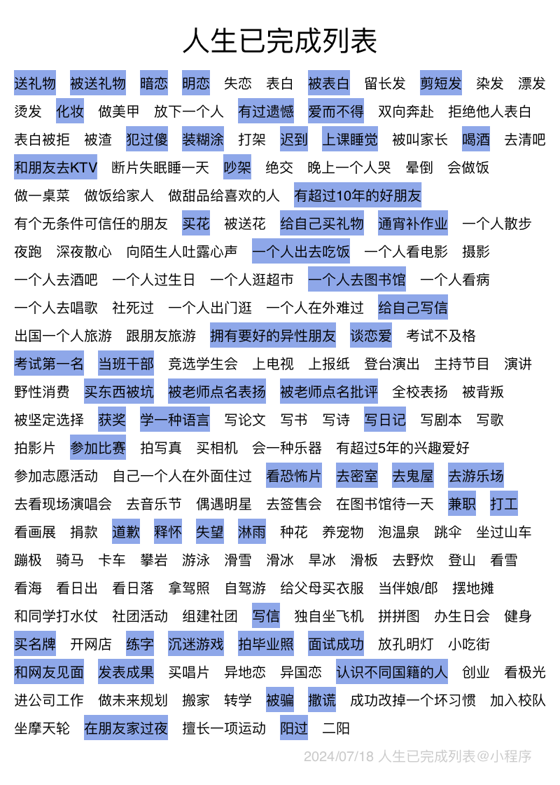

# 树林
## 四条主线
### ❤生命最好的状态是：所行无碍
### 执行力
### 心之力
#### 缺乏的原因
- 没有清晰的目标
- 没有价值感
- 没有催人上进的环境和人
- 过早的富媒介，正态分布
#### 变化
- 环境变化
- 身边的人
- 身体的变化
- 做事的变化
- 想法的变化
- 情绪的变化
### 开放度
#### 没有人能客观地认识世界，重要的就是频繁出现在生命里的
#### 信息浓度
##### 谁高频地出现在我的世界，谁就最重要。
####  走运走运，走出去才会好运
#### 被骗的周期越短越好
### 对抗下坠
#### 无序开放=吃屎
#### 他们可以随地大小便，但我们不能随便吃屎
## 两个问题
### 高浓度的信息来自哪里

## 觉醒的四要素
### 认是有局限的
#### 人局限于立场
- 人局限于自己看到的世界
- 多说我们，考虑我们的立场
- 一定有人一步登天
- 人一定有痛点和需求
#### 老的就死掉
# 姜哥
## 教育
### 
# 漫漫
## 不要把短视频当作救命稻草
### 打破信息茧房
- 多刷自媒体
- 点不感兴趣
### 多去社交
> 某种情况下，人脉会比单纯学习更有用
- 大胆向博主提问
- 跟品牌pr们打好关系
## 自洽是个人ip魅力的来源
### 只要你敢说，别人就会信你
### 你只要做了，就一定能帮到人
### 不要去模仿，更不许抄袭
> 别人的生活你学不会，你的生活有独特的魅力
### 你在成长就会有启发
#### 普通人的经验比天才的方法论更管用
> 第一次坐飞机、坐高铁
##### 你在做什么，就去发什么
##### 做自己，分享自己擅长的，把选择权交给用户
> 去跟用户聊天，喜欢我的理由？
##### 成长的过程偶尔比结果更吸引人
##### 持续不断地记录改变
##### 从零开始可以做的活动：30天挑战编程项目
##### 收集用户反馈
##### 把写文章的目的变成：帮助曾经的自己、处于那个阶段的人
#### 对话感：说人话
##### 我要解释给你听、你就是我想吐槽的对象、什么会让我真的生气、我最想跟唱反调的人解释些什么
##### 写文章时假想一个极度想改变的对象
#### 对标
##### 从对方的分享中找到一个你也有话语权、经历过的话题，分享你的故事、意见、感受
#### 真诚+自我暴露：信任感Up
