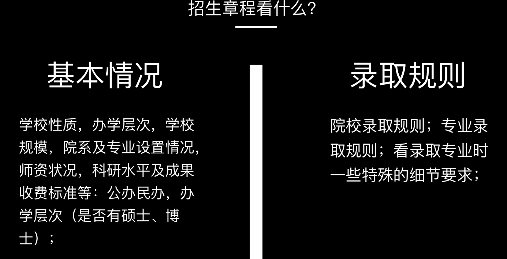

# :school:志愿的基础概念
## :man:高考录取管理角色
- **[省考试院](https://www.zjzs.net/col/col27/index.html)**
- **高校招生办**
## :bell:高考录取流程
- __院校投档__
- __院校录取__
- __预投档≠模拟志愿__
> __模拟投档->正式投档->预录取->正式录取->通知书__
- ==平行志愿==|顺序志愿
#### :x:退档发生在提交志愿后的3~5天
#### 顺序志愿第一志愿保守:当学校录取位次历年波动较大，取高位次估计
#### 判断学校生源情况：历年征集志愿状况
#### 位次
- 高分段估计**准确**
- 中分段位次波动**极大**，参考价值**低**
#### 线差
- __即相较省控线，特空线等的分数差值__
- 适合压线考生估计
- 二本波动较一本大
### 专业录取规则
#### ==每个学校采用规则不同，具体到院校官网查询==
#### 分数清
- 大部分学校采用
- 分数优先
- 进学校后再通过平行志愿分配专业
#### 专业极差
- 少部分学校采用
- 分数清+减分重排
- 靠后的志愿总分降低与他人竞争
- 若存在，建议该专业靠前排，甚至稳专业都可置于冲专业前。确保稳专业应将分数降低，考虑极差影响
- 查询院校招生章程，注意录取规则对应到院校下的具体专业
#### 专业清

### 阳光高考
#### [点击直达官网](https://gaokao.chsi.com.cn/zyck/)
#### 招生简章 食宿条件 收费标准 招生办电话
#### app 公众号 微博
#### 电话：请问有没有我省招生负责人的联系方式

### 征集志愿
- 定个闹钟，每天早上起来检查考试院官网

Example [^1]
[^1]: Hi! This is a footnote
30^th^
H~2~O
==marked==
[GitHub](https://github.com)