### 冲稳保注意事项
#### 冲一冲：考虑波动性
- 考虑偶尔进入我的区间的学校
- 规避红线
    - 不要让自己痛苦
    - 转专业第一年很痛苦 *全班第一*

- 天命院校:
    - 分数稍高 
    - 波动较强 
    - 学校实力强 
    - 冷门专业我喜欢
#### 稳一稳：考虑匹配
- 尽可能全覆盖
- 脚踏实地
- 必须认真
#### 保一保：
- 选王牌专业要理性
- 确保意向
- 分层次保
### 新高考背景下的冲稳保
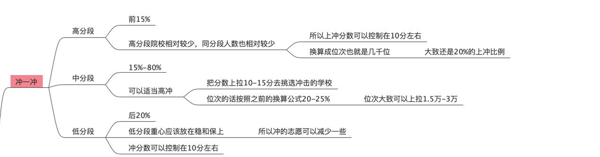

# day4
## 了解院校的基础信息
- 学校头衔
- 地理位置
    - 可以是大城市的经济开发区，但不要是郊区
    > 如果是位于四五所大学周围的大学城的话也可以考虑。
    郊区的实习企业少，通勤花时间，严重影响工作质量
    - 考虑娱乐设施
- 学术实力指标
- 后续规划
    - 国内升学率
    - 出国率
    - 就业率
- 主观评价
    - 综合满意度
    - 生活满意度
        - 几人间
        - 独立卫浴
    - 环境满意度
    - *阳光高考*，*大学生活指北*
    - 男女比例
    - 娱乐即基础设施（食堂饭菜，商圈，外卖，好吃的，酒店）

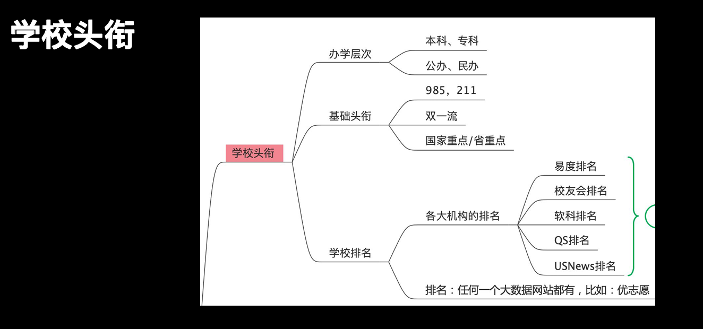
https://www.tanmizhi.com/html/35197.html
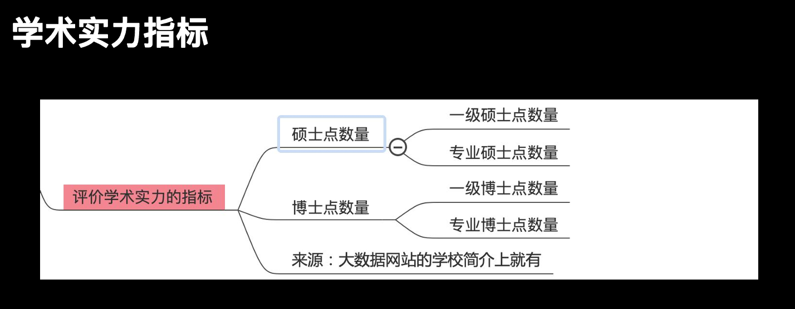
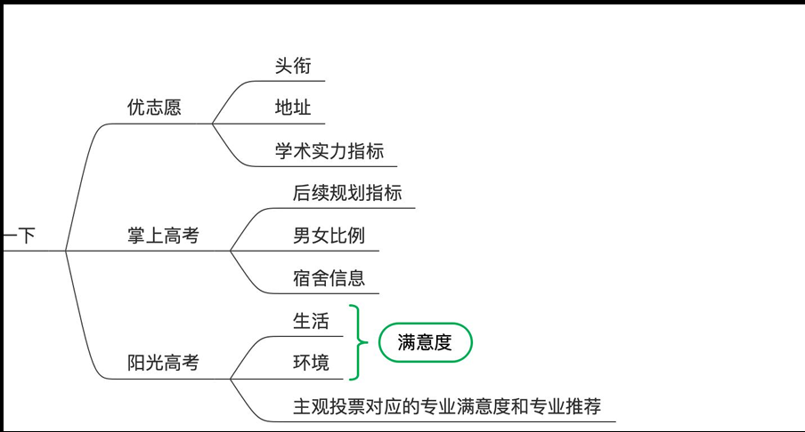
### 找到大学的优势专业
#### 1. 从学校历史看
> **注意名字表面的坑**
#### 2. 国家的硬标准
- 同层次院校比专业评估
- **百度百科**调查学校专业 真不戳
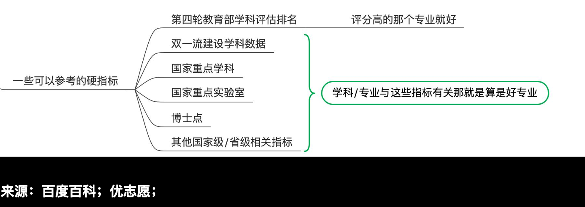
### 如何对比专业谁更好
#### 教育部专业评估相同的情况下
- 博士点
- 硕士点
- [中国研究生招生网](https://yz.chsi.com.cn/)
#### 了解院校的妙招
##### 核心逻辑
- 贴吧、知乎、微博、小红书、抖音
- 官方自媒体账
- 切换身份的底层逻
- 高校新生群
    - 进群后干什么？
· 纯观察；
· 列点有效提问；
· 加人做朋友
- 提前做准备
    - 对他的内容表示欣赏，对他个人表示喜欢，介绍自己，
点名毕业生定位，表明意图，寻求联系方式

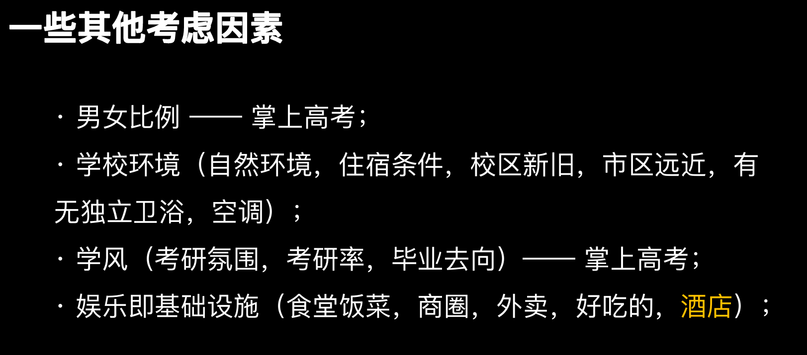
- 有没有通宵自习室，要不要抢位置
- 南京冬天无集中供暖
- 大型商圈
    - 十公里内有无大型购物商城
    > 它就是你大学四年最多逛的商城
- 外卖好不好吃
    - 种类多不多
    - 评价怎么样
    - 外卖能不能送到门口？
- 酒店
# day5

## 对专业的深入了解
### 对专业的概览了解
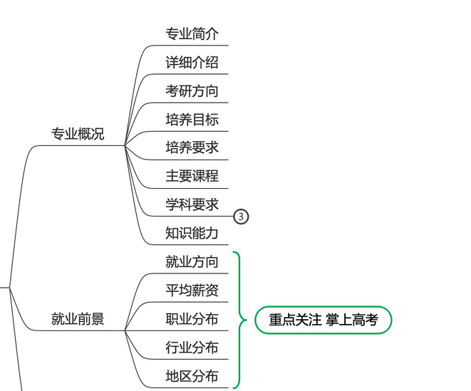
### 了解排名信息
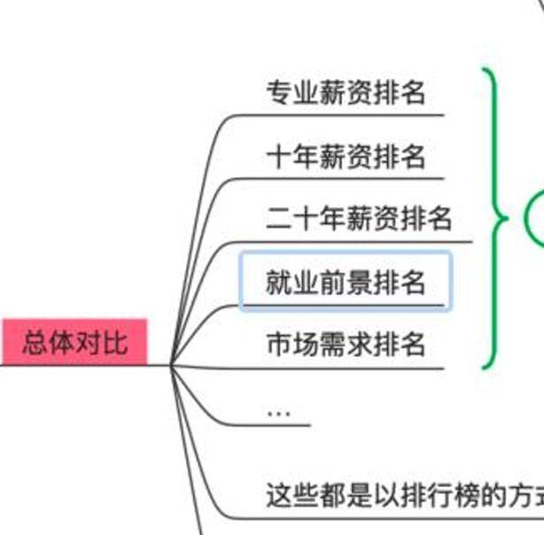
### 了解趋势信息
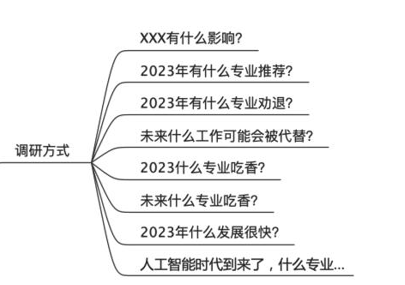
### 身份转换
- 专业的培养方案----阳光高考
- 求职者---领英、boss直聘
### 相关注意事项
- 专业表和院校表的关系
- 专业+院校的填报
- 新高考的注意事项
- 大类招生 
## 了解城市
### 看人口数和人口增长[数位观察](https://m.swguancha.com)
### 广义经济发展
    - 出门走，去省会，去写字楼密集的地方
    - 傍晚去奢侈品购物中心
    - 人均gdp
### 第三产业比重以及增速
    - 衡量发展程度和潜力
### 和专业及人生规划的匹配程度
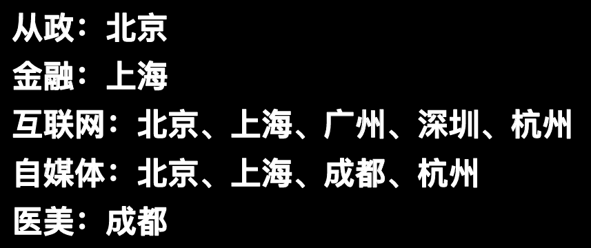
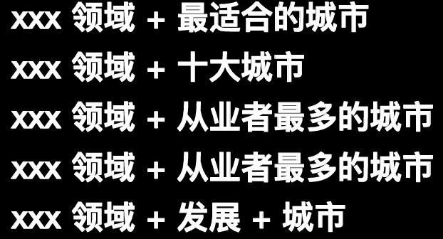
### 一些好玩的指标
- 平均房价
- 平均薪资
- [全国房价](https://m.gotohui.com/fangjia/)
### 考虑大学和人生规划
#### 如果可以，尽量去大城市
### 关于省内省外的取舍
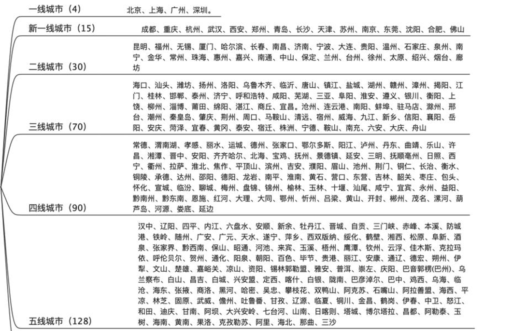
### 按层次分
- 区域中心城市
- 副省会中心城市

# 永远事前做判断，而不是事后做解释
