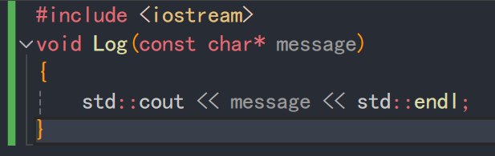
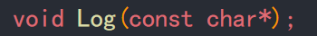
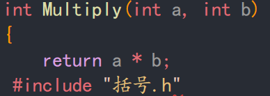
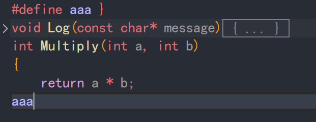
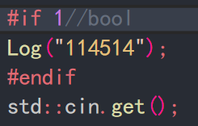
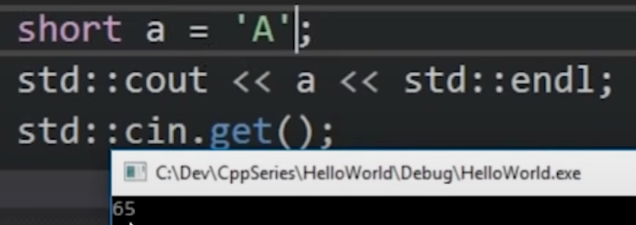
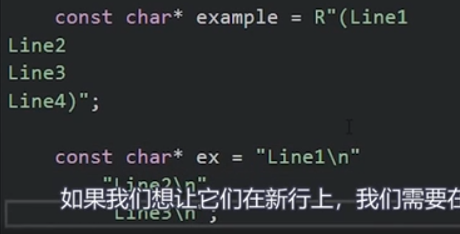

# c++学习笔记
***bilibili***:
- [【C++教程】国外大佬C++技术教程，油管百万级收藏，学C++看这个就够了！（中文字幕）】](https://www.bilibili.com/video/BV1oD4y1h7S3/?p=38&share_source=copy_web&vd_source=339e162e97a8a037c13224d541e53d6e)

***YouTube***:
- [C++ ---The Cherno](https://youtu.be/H4s55GgAg0I?si=HbTbWe_UVIKvGUu3)
-
## setupProject(visual studio)
### 分清filter过滤器和folder文件夹的含义
## 头文件
### 用于声明函数，并在各个cpp文件中include
### c++标准库头文件一般不包含扩展名，包含扩展名的为c标准库
## 编译器与连接器
### 定义可在其他文件中，使用函数前必须声明。
### 定义则存在body，声明甚至可以省略命名传参，但必须指定类型。如图2



## 预处理
### vs中可以直接显示预处理后的文件
### 编译器通过预处理后的文件判断代码是否能够正常编译
### **头文件**就是把文本粘贴过来。如图，编译通过，输出正确

### `#define`语句，遍历搜索并全部替换字符串，如图编译通过，输出正确

### `#if` `#endif` 语句

## 变量
### 所有类型都是让生活变得更好的一种方式，它的本质仍是数据
### 数据类型的区别只在于创建时分配内存的多少，并不一定规定所需表示的意义
### int 整型
#### 4byte即32位二进制数来表示一个数字，即最大值为±2^31
#### 使用unsigned修饰可略去符号位，表示32位二进制正数
#### 字符与数字在存储时没有区别，前者通过ascii码转换。

- **`char`** 1 byte 数字
*在控制台输出中,自动将char类型的数字转换为字符串*
- **`short`**  2 byte
- **`long`** 4 byte
- **`long long`** 8 byte
- **`float`** 4 byte
- **`double`** 8 byte
- **`bool`** 1 byte
- **`const char*`** 字符串
> 可以直接使用如`2.5f`来定义单精度浮点
> 除了0以外的任何数字都表示true
### 指针变量 
#### 在定义的变量类型后添加`*`
```c
int* ptr;
```
### 引用变量
```c++
int a = 0;
void aa(int& i){
    i++;
}
aa(a)
//1
void bb(int i){
    i++;
}
bb(a)
//1
```


## 条件和分支
- `if`
- `else`
- `if else`

## 循环 loops
### for循环
#### 三个参数
- 变量声明,刚开始循环运行一次。(可以缺省，只需将i在循环前声明)
- 循环条件
- 下次循环发生前执行的代码
```c
for (int i = 0; i < 5; i++){}
```
#### 三个参数都可以缺省，发挥想象
### while循环
#### 一个参数(循环条件)
```c
while (i<5){}
```
### do while
#### 一个参数(循环条件)
#### 在判断条件前先执行一遍代码
```c
do{}
while(condition);
```

## 流程控制
### `return`
#### 结束当前函数并返回值
### `break`
#### 循环结束，跳出整个循环
### `continue`
#### 跳转到for循环的下一次迭代。结束本次循环，并执行for的第三个参数
 
## 指针
### 所有指针都是一个int整数，存储内存地址的数字 1byte
### 原始指针 raw_point
- `void*`无类型指针,不可解引用
- `&变量名`返回变内存地址,即指针
- `*指针名`解引用指针,即访问内存地址指向的变量数据，可以读写
- `(数据类型)变量`显式的强制变量类型转换


```c++
void* ptr;
int a = 114514;
int* ap = &a;//假设地址为1919810
printf(ap+1)//1919814
```
## 数组 array
### 元素的集合
### 定义：
```c
int example[5];//在栈上创建一个长度为5的int数组
printf(example)//打印第一个元素的内存地址
example[0] = 2;
int* ptr = example;//数组本质是一个int指针
*(ptr + 2)=6//example[2]=6,效果相同
*(int*)((char*)ptr+8)=6;//与上述相同
int* another = new int[5];//与第一句效果相同，在堆上创建，对象的生命周期更长
delete[] another;
```
### 特别的
#### 当数组作为传参时会被自动转换为指针类型,且并不会在新的栈上拷贝整个数组，因此在函数中也可对其进行删改
```c++
void aaa(int a[])
{
    printf(sizeof(a))//4 (byte)
}
int a[]={1,2,3,4,5};
aaa(a) //4 (byte)
printf(sizeof(a))//20 (byte)
```
#### 可以将数组类型作为指针类型直接使用
### 二维数组
```c++
int A[2][3];//定一个一个2x3数组
int* p = A;//这是错误的
int* p[3] = A;// √
printf(A,&A[0])//结果相同，可解释上行
printf(A,*A)//结果相同，含义不同，前者表示该二位数组的头，后者表示二维数组第一个元素的头（即A[0]）
printf(A + 1)//py数组切片？等效于去掉了A数组的第一行，指针指向了第二行
//一定一定要把指针和数组放在一起理解
delete[][] //这样的语法不存在，删除二维数组只能一个个遍历进行删除
int** aaa[5];//定义一个5x5的二维数组，但这五个区域不是连续的,遍历时比一维25个慢很多

//相比较下遍历更快的方法
int* array = new int[5*5]
for(int i = 0 ; i<5;i++)
{
    for(int j = 0;j<5; i++)
    {
        array[i*5+y]=2;
    }
}


```
#### 等效的几个式子
- `*A`,`A[0]`,`&A[0][0]`
- `A+1`,`&A[1]`
- `*(A+1)`,`A[1]`,`&A[1][0]`
- `*(A+1)+2`，`A[1]+2`,`&A[1][2]`

## 字符串
### 本质上是一个char数组
```c++
char a[] = "love";
const char* name="soirks";//在栈上分配,不可变字符串
char* namec="soirks";//可变字符串
char name2[7]={'s','o','i','r','k','s','\0'}//效果同上，0用于告诉编译器字符串终止
//0与"\0"等效
//std::string
std::string name = "soirks";
```
### `"soirks"s`可以将char*类型转为标准string

### 多行字符串的操作

## 引用
### 使用：类型加上&
### 定义一个虚拟变量，如
```c
int a = 114514;
int& b = a;
```
<details>

<summary>🌰使用场景</summary>

### 当我们想调用函数实现变量自增时，可能写出如下代码，而实际输出为5

```c++
   void increase(int aaa) {
    aaa++;
}
int main()
{
    int var = 5;
    increase(var);
	std::cout << var << std::endl;
}
```
### 可以通过以下代码实现
```c++
void increase(int* aaa) {
    (*aaa)++;
}
int main()
{
    int var = 5;
    increase(&var);
	std::cout << var << std::endl;
}
```
### 最优解为使用 引用
```c
void increase(int& aaa) {
    aaa++;
}
int main()
{
    int var = 5;
    increase(var);
	std::cout << var << std::endl;
}
```
</details>


### 与函数别名类似，即变量别名。
### 声明一个引用时必须赋值，且之后不能更改引用的对象。如果你需要改变，请使用指针，具体参考上述代码中的第二种方式

## new关键字
### 在堆上分配内存
### 返回对象指针
### 操作符
即可以重载

[跳转至运算符](#ysf)
```c++
class Entity(){}
int a = 2;
int* b = new int[50]//200 bytes
Entity* e = new Entity[50];//在栈上分配50个entity
Entity* e = new Entity();//在栈上分配并调用构造函数
Entity* e = (Entity*)malloc(sizeof(Entity))//在栈上分配内存但不调用构造函数，malloc来自c语言----在cpp中你不应该这么用
delete e;//请不要忘记删除内存
free(e)//来自c语言的删除,对应malloc分配的内存
delete[] b//对于数组请这么删除

```
### placement new
```c++
Entity* e = new(b) Entity();
```
## 类 class
###  创建并实例化类 
#### 在堆分配类
```c++
class Entity(){}
Entity* entity = new Entity();
//从性能来看，在栈上分配内存的效率更高，且堆上的内存必须手动释放
delete entity;
```
### 来写一个logger（todo）
- 设置输出等级
- 输出入口

### 构造函数
#### 每一次实例化对象时都会调用该方法
#### 定义构造函数:`类名(){}`
#### 当定义一个private的构造函数时，则可以阻止外部创建该类的实例
#### 或者使用`类名()=delete;`
### 隐式构造函数、隐式转换、explicit
```c++
class Entity
{
private:
    std::string m_Name;
    int m_Age;
public:
    Entity(const std::string& name):m_Name(name),m_Age(-1){}
    Entity(int age):m_Name("Unknown"),m_Age(age){}
    int GetAge(){return m_Age;}
}
void print(Entity& e){
    //print
}
Entity a("Soirks");
Entity b(22);
//推荐以上用法
//以下为隐式转化
Entity a = "Soirks";
Entity b = 22;
print(const Entity& a){
    std::cout << a.GetAge << std::endl;
}
print("Soirks")
print(22)
//正常输出
//调用函数时，编译器自动将变量通过*构造函数*隐式转化为Entity类。
//禁用隐式转化，在构造函数前加explicit
explicit Entity(int age):m_Name("Unknown"),m_Age(age){}
Entity aaa = (Entity)15
```
### 析构函数
#### 当父函数结束，对象被销毁时调用
#### 定义析构函数:`~类名(){}`
#### 使用场景：手动在堆上改变了内存时
### 虚析构函数
实际上不是覆写析构函数，而是再次添加一个虚构函数
基本上对于基类的析构函数，一定得是虚函数
```c++
class Base
{
public:
    Base(){}
    ~Base(){}
    //此时只需要标志其为虚函数即可解决下述问题
    //virtual ~Base(){}
}

class Derived: public Base
{
public:
    Derived(){}
    ~Derived(){}
}
//当删除derived的实例时，两个析构函数均会调用
Base* aaa = new Derived()
//但是当删除aaa时，只会调用Base的析构函数

```
### 构造函数初始化列表 
```c++
//使用初始化列表能避免类成员类型为类时对象的重复创建，利于提高性能，建议习惯使用
class Entity{
pirvate:
    int age,weight,height;
public:
    Entity()//构造函数
    :age(8),weight(50),height(180)//初始化列表
    {
    }
}
//代码超出类的作用域时，类会被自动销毁
{

}
//单独一个花括号也可以形成类似函数的局部作用域
```
### 类的继承
#### 从父类继承来防止代码重复
#### 使用
```c++
class 子类: public 父类
{
    
}
```
## 结构体 struct
### 结构体与类的唯一区别
 默认情况下，类的成员是私有的，而结构体是公有的
### struct多使用在存储单一数据时使用。
## static
### 在类和结构外部
#### 使用static使变量只会在该cpp文件中产生链接
#### 而使用extern则效果相反
#### 在头文件中声明变量时作用挺大
### 在结构体内
#### 被static修饰的变量将作为该类下的全局变量。任意实例下的修改将作用在全体实例上，即对player1的修改，同时作用在player23456身上
#### 使用结构体内部的静态对象前，必须声明
### 在函数内
#### 局部静态
#### 定义了一个全局变量，但只有函数内部可以访问，外部无法访问
#### 该声明扩展了对象的生命周期，使其在当前父函数运行完毕后仍然存在。
#### 二次调用函数时，无需反复创建内存，直接使用第一次创建的对象。
#### 运用场景：在类内部通过get（）方法存储一个公用实例。

## 枚举 enmu
### 一个对象，方便用字符串代替数值，使代码可读
### 具体操作
```c
enum example: int//int可以省略
{
A=5;B=3,C=1//若不赋值，则默认从0递增
};
//外部则可以直接通过A来访问数值
```
## 虚函数
### 关键字`virtual`
### 使函数在子类能够被覆写
### 纯虚函数`virtual int aaa()=0`
### 要求函数必须在子类中覆写
## 可见性
### `private`
### `protected`
### `public`


## 常量 const 与 mutable
### 这是一个承诺，它可以打破
### `const int*`指针指向的数据本身不可变
### `int* const`指针的内存地址不可变
### 类的成员函数声明时
```c++


const int* a =90;//禁止改变指针内容
int* const b =new int;//禁止改变指针地址
int const* aa = 90;//效果同1


class Entity{
private:
    int* a,*b;//!一行声明两个指针变量时请这样做!
    mutable int c;
public:
    void aaa() const//表示该函数不修改其所属类的成员
    {
    c = 1;//当我们将变量用mutable修饰时，则可在const函数中对其修改
    a = nullptr;//报错！！！
    }
    const int* const rrr() const{
        return a;
        //返回一个不能被修改的常量指针
    }
}

print(const entity& e){//定义了该方法不修改e对象，则该
    e.aaa();//故该方法必须用const修饰
}

//在lambda表达式中的mutable
int a = 10;
auto f = [=] () mutable 
{
    a++;
    std::cout << a << std::endl;
    // 11
}
std::cout << a << std::endl;
//10
//此时mutable使得在局部复制了一份全局变量
```

## 三元操作符
```c++
int level = 1;
int speed = 2;

if (level>5)
    speed = 10;
else
    speed = 5;
//等效于
speed= level > 5 ? 10 : 5;
//嵌套
speed = level > 5 ? level > 10 ? 15 : 10 : 5;
//即
if (level>5)
    if (level>10)
        speed = 15;
    else
        speed = 10;
else
    speed = 5;
```
<a id="ysf"></a>

## 运算符及其重载
```c++
struct vector2{
    float x,y;
    vector2(float a , float b)
    :x(a),y(b){}
    vector2 operator+(const vector2& other) const
    {
        return vector2(a+other.x,b+other.y);
    }
    bool operator==(const vector2& other) const
    {
        return x== other.x && y == other.y;
    }
    bool operator!=(const vector2& other) const
    {
        return !(*this==other);
    }
};
vector2 aa(1.2f, 1.3f);
vector2 bb(1.3f, 1.4f);
vector2 cc = aa + bb;//2.5 2.7
std::ostream& operator<<(std::ostream& stream,const vector2& other)
{
    stream << other.x << "," << other.y;
    return stream;
}
std::cout << cc << std::endl;//2.5,2.7
```
## this关键字
### 在结构体内的this表示该结构体的指针 n
### this的类型必须是const
## ->
访问指针对应数据的变量
```c++
this->x
(*this).x
//两者等价
//↑ 90%使用场景
//以下为操作符重载
class ScopePtr
{
private:
    Entity* m_Ptr;
public:
    ScopePtr(Entity* Ptr)
    :m_Ptr(ptr){}
    ~ScopePtr(Entity* Ptr)
    {
        delete m_Ptr;
    }
    Entity* operator->()
    {
        return m_pyr
    }
    void print() const {printf("Hello!")}
    const Entity* operator->() const
    {
        return m_pyr
    }
}

scopedPtr entity = new Entity();
entity->Print();
//偏移量计算

```
## 栈作用域生存舟曲
### 栈的概念
栈上声明的东西，超出范围后就会free
```c++
int* CreateArray(){
    int array[50];
    //应当更改为=>int* array = new int[50];
    return array;
}
int* a = CreateArray();//无效
```
### 在堆上分配的内存实现自动删除
```c++
class ScopePtr
{
private:
    Entity* m_Ptr;
public:
    ScopePtr(Entity* Ptr)
    :m_Ptr(ptr){}
    ~ScopePtr(Entity* Ptr)
    {
        delete m_Ptr;
    }
}

{
ScopePtr e = new Entity();
}
//超出后e会自动销毁

```
## 智能指针（unique，shared，weak）
调用new时，自动调用delete
本质上为一个原始指针的包装
```c++
#include <memory>
class Entity{
    void Print(){}
}
{
    std::shared_ptr<Entity> e0;

    {
    std::unique_ptr<Entity> entity(new Entity());//必须进行显示构造
    std::unique_ptr<Entity> entity = std::make_unique<Entity>();//对于异常更安全
    //entity对象仍存储在堆上，指针存储在栈上
    //unique指针禁止被复制
    //开销极小
    entity->Print()

    std::shared_ptr<Entity> sharedEntity = std::make_shared<Entity>();//请这么做，更有效率
    e0 = sharedEntity;//可以复制

    std::weak_ptr<Entity> weakEntity = e0;//他不会增加e0的引用次数，故若e0被销毁，weakEntity则会指向一个无效指针
    }//运行到此时shareEntity(ptr)被销毁，其引用次数为1 
}//运行到此时e0的ptr销毁，引用次数为0，则其内存被销毁
    
```
## 拷贝与拷贝构造


```c++
 int a = 2;
 int b = a;
 //两者为不同的内存块
struct Vector2
{
    float x,y;
};
Vector2 a = {2，3};
Vector2 b = a;
//效果同上
Vector2* ap = new Vector2();
Vector2* bp = ap;
//当修改*ap的值时，*bp也会改变，两者指向同一内存 
ap->x = 2;
//任何使用=号的都在copy，引用类型除外（此时=为设置别名）
//当类进行拷贝时，直接拷贝类的每一个成员

//一个基本的string类
class String
{
private:
    char* m_Buffer;
    unsigned int m_Size;
public:
    String(const char* string)
    {
        m_Size strlen(string);
        m_Buffer = new char[m_size + 1];//！！！实际上这里有一个内存泄漏
        //for(int i = 0;i++;i<m_Size){m_Buffer[i]=string[i]}
        memcpy(m_Buffer,string,m_Size);//该方法更快
        m_Buffer[m_size] = 0;
    }
    //拷贝构造
    String(const String& other)
    : m_Size(other.m_Size)
    {
        m_Buffer = new Char [m_Size + 1];
        memcpy(m_Buffer,other.m_Buffer,m_Size + 1);
    }
    //禁止拷贝
    //String(const String& other) = delete;
    ~String()
    {
        delete[] m_Buffer; 
    }
    char& operator[](unsigned int index){
        return m_Buffer[index];
    }
    friend std::ostream& operator<<(std::ostream& stream,const String& string);//使<<操作符为友元，则其可以读取私有成员
}
std::ostream& operator<<(std::ostream& stream,const String& string)
{
    stream <<string.m_Buffer;
    return stream;
}

String aaa = "Soirks";
String bbb = aaa;
printf(aaa);
printf(bbb);
//Soirks
//Soirks
bbb[1] = 'a'
printf(aaa);
printf(bbb);
//当为定义拷贝构造时：
//Sairks
//Sairks
//定义拷贝构造后：
//Soirks
//Sairks
//程序退出时崩溃
//由于bbb=aaa时，对象进行了一次浅拷贝，两者成员的m_Buffer指向同一内存块
//故对象销毁时执行了两次delete ptr;
//第二次则变为了delete nullptr 故造成崩溃

//使用拷贝构造函数进行深拷贝，解决以上问题
//always 使用 const引用 string类型

```

## 动态数组 Vector
### 基础使用
```c++
include <vector>
struct Vertex
{
    float x,y,z;
}
Vertex* aa = new Vertex[5];

std::ostream& operator<<(std::ostream& stream,const Vertex& bertex)
{
    stream << vertex.x << "," << vertex.y << "," << vertex.z;
    return stream;
}
std::vector<Vertex> bb;
bb.push_back({1,2,3})
bb.push_back({4,5,6})
for(int i = 0;i<bb.size();i++)
{
    std::cout<< bb[i] << std::endl;

}
//以下更简洁
for (Vertex v : bb)
    std::cout<< v << std::endl;
//1,2,3
//4,5,6
bb.clear();//清空
bb.erase(bb.begin()+1);//移除第二项

//!!!传参vector时请务必使用引用
```
### 如何优化vector效率
```c++
struct Vertex
{
    float x,y,z;
    Vertex(float x,float y,float z)
    : x(x),y(y),z(z)
    {
        
    }
    Vertex(const Vertex&)
    {
        std::cout << "Copy!" << std::endl;
    }//拷贝构造

}
int main
{
    Vector<Vertex> a;
    //!!!优化① 
    bb.reserve(3) //提前告知内存大小
    //!!!
    //优化分析
    a.push_back(Vertex(1,2,3))//vertex在main中创建，并且copy进vector----copy*1
    a.push_back(Vertex(4,5,6))//vector内存不足故copy（1，2，3），（4，5，6）在main中创建copy进a————copy*2
    a.push_back(Vertex(7,8,9))//vector内存不足故copy（1，2，3）、(3,4,5) , (7,8,9)在main中创建copy进a————copy*3
    //无优化共输出6个copy
    //!!!优化②
    bb.emplace_back(1,2,3);
    bb.emplace_back(4,5,6);
    bb.emplace_back(7,8,9);
    //！！！传入构造所需参数
    //优化后，输出0 copy
}

```

## 使用库 (glfw)
### 对于重大项目
在vs中添加库的源代码，自行编译外置库，有助于调试，也可以更改库
### 对于快速项目
采用链接预编译的二进制文件
#### 32位与64位的选择
只需要与应用程序的位数相同即可，与开发环境编译系统无关
### 通常包含includes与libraries  
#### 静态库
会被放入exe文件中，更快，编译时会被优化
#### 动态库
以dll的形式外置，程序启动时链接
### vs的配置（静态链接配置）
添加外部库
1. 在sln目录下创建denpendencies
2. 在其中创建glfw
3. 拖入对应vs编译的文件夹以及include
4. 项目->属性->c++->常规->附加包含包目录->输入`$(SolutionDir)dependencies\glfw\include`
5. 在代码中添加#include "GLFW/glfw3.h"
链接到外部库
1. 项目->属性->链接器->输入->附加依赖项->输入`glfw3.lib`
2. 项目->属性->链接器->常规->附加数据库目录->输入`$(SolutionDir)dependencies\glfw\lib-vc2022`
**注意配置时选择正确的配置**

当我们除去include glfw
使用 `extern "C" int glfwInit();`
调用该函数时仍然可用，因为链接器已链接
`int glfwInit()`不可用是因为c++混淆了函数名，而该库为c库
### 动态链接
项目设置同上，但在链接外部库时使用`glfw3dll.lib`
请将dll粘贴到exe目录
```c++
#include "GLFW/glfw.h"

```
## 创建与使用库
TODO视频：vs的最佳设置
### 一个解决方案包含多个项目 vs配置（静态链接）
**例：一个库项目与一个主程序项目**
添加库：
项目->属性->c++->常规->附加包含包目录，添加库项目目录
即可方便在主程序项目引用头文件
> 在解决方案内的文件建议使用“”进行include
> 来自外部的依赖库建议使用<>进行include
添加链接：
右键主程序项目->添加->引用->勾选库项目，即可添加lib文件引用
**此时**，vs已实现自动化编译流程，即编译主程序时，优先编译库文件
## 堆与栈的内存比较
### 都存储在ram中
### 堆访问
先检索空闲列表
请求内存
记录数据
## 宏
### 是什么
使用预处理器来"宏"化操作
在编译之前进行纯文本替换

### 适用场景
```c++
//简单操作 stupid!!!
#define WAIT std::cin.get()


#ifdef _DEBUG //vs项目属性中debug模式下默认定义的变量
#define LOG(x) std::cout << x << std::endl
#else
#define LOG(X)
#endif
//实现release禁止输出日志
//多行define,\代表换行
#define MAIN int main()\
{\
    std::cin.get();\
}

}
int main()
{
    WAIT;
    LOG("Hello");
}

//更多例子在检查opengl错误的视频里
//高级操作 跟踪、调试、
```

## 多返回值的处理
```c++
//传递指针
void ccc(string* vs , string* cs)
{
    *vs = xxx;
    *cs = xxx;
}
std::string vs,cs;
ccc(vs,cs)

//tuple 元组 不推荐
#include <utility>
#include <functional>
static std::tuple<std::string,std::string> cc(const std::string& aa)
{
    return std::make_pair(vs,fs);
}
auto aaa = cc("abc");
std::string vs = std::get<0>(aaa)

//但在cpp17中也有合适的办法-结构化绑定
auto[data1,data2] = cc("114514","1919810")
printf(data1,data2)

//struct 墙裂推荐
struct source
{
    std::srting x,y
}

source aaa(std::string aaa)
{
    ///xxxxx
    return {x,y}
}

auto a = aaa("ccccc")
a.x;
a.y;
//便于访问
```
## template 模板 (java泛型)
```c++
template<typename T>
void Print(T value)
{
    std::cout << value << std::endl;
}
//函数调用时才会被创建
Print("114514");
Print<std::string>("114514");//编译器会自动获取类型，此处尖括号可以省略


template<typename T，int N>
class Array
{
private:
    T m_Array[N];
}
Array<int,5> array;


```

## auto关键字
使用auto来声明变量，自动识别接受的变量类型
也可用于定义一个结构化绑定
### 你应该这样做
```c++
int a = 5;
auto b = a;
auto c = 5f;//"string" 5L

std::vector<std::string> strings;
strings.push_back("Apple");
strings.push_back("Orange");
for (std::vector<std::string>::iterator it = strings.begin();
    it != strings.end();i++)//for (auto it = strings.begin();it != strings.end();i++)  更佳的做法
{
    std::cout << *it << std::endl;
}


class Device{};
class DeviceManager
{
private:
    std::unordered_map<std::string,std::vector<Device*>> m_Devices;
public:
    const std::unordered_map<std::string , std::vector<Device*>>& GetDevice()
    {
        return m_Device;
    }
}
DeviceManager dm;
const auto& device = dm.GetDevices();//这里的&是必须的


```
### 而不是滥用
```c++
//短类型不建议使用auto,这会降低代码可读性
std::string GetName()//当这里需要改变类型时，后文就无需做出修改，对于一些s-to-c具有帮助 
{
    return "Soirks";
}

auto name = GetName();
```
## 静态数组 array
```c++
#include <array>
std::array<int , 5> data;
data[0] = 2;


template<int T>
void PrintArray(int* array<int,T>& data)
{
    for(int i = 0;i< data.size();)
    {

    }
}
//工作方式
//array在栈上创建，vector在堆上创建
//array很快，性能与原生数组一样
//array可以记录容量大小
```
## 原始指针 （原始函数指针）
```c++
//什么是函数指针
void HelloWorld()
{
    std::cout << "Hello Wolrddd!"<< std::endl;
}

auto function = HelloWorld;// 实际上为&HelloWorld,返回了函数指针
void(*function)();//实际的类型声明
function = HelloWorld;
function();


//实际的应用
void ForEach(const std::vector<int>& vec,void(*func)(int))
{
    for(int value:vec)
    {
        func(value);
    }
}
void Print(int a)
{
    std::cout << a <<std::endl;
}
std::vector<int> values = {1,2,3,4,5};

ForEach(values,Print);//对于vector中的每一个元素执行一遍Print

//lambda匿名函数用法
ForEach(values,[](int value){Print(value)})
```
## lambda 匿名函数
```c++
//接上部分代码
auto lambda = [/*capture*/](int value){/*body*/};
//capture
// [=] 拷贝外部所有变量
// [&] 引用外部所有变量 
// 单独填写变量名
#include <functional> //原始指针无法保存定义捕获的匿名函数,请使用std::function
std::function<void(int)& int> = [=](int value){/*body*/};
//mutable 修改拷贝是修改函数体内还是外？
[=](int value) mutable 
{/*body*/}
//将外部变量拷贝到函数体内，内部的变量可以被重新赋值，但外部变量不受影响
//为什么我们要用匿名函数
//更加方便 例子略

```
## 线程
```c++
#include <thread>
static bool s_Finish = false;
void DoWork()
{
    using namespace std::literals::chrono_literals;
    while (!s_Finished)
    {
        std::cout<< "Working..\n";
        std::this_thread::sleep_for(1s);
    }
}
int main()
{
    std::thread worker(Dowork);
    std::cin.get();
    s_Finish = true;
    worker.join();//阻塞当前线程，等待工作完成，实际上是等待线程加入
    std::cout << "Finish." << endl;
    std::cin.get();
}
//实现不断输出working的同时等待回车结束。

```
## 计时
执行代码时间
```c++
#include <chrono>
#include <thread>
using namespace std::literals::chrono_literals;
auto start = std::chrono::high_resolution_clock::now()
std::this_thread::sleep_for(1s);
auto end = std::chrono::high_resolution_clock::now();
std:;chrono::duration<float> duration = end - start;
std::cout<< duration.count() << "s" << std::endl;

struct Timer
{
    std::chrono::time_point<std::chrono::steady_clock> start,end;
    std::chrono::duration<float> duration;
    Timer()
    {
        start = std::chrono::high_resolution_clock::now();
    }
    ~Timer()
    {
        end = std::chrono::high_resolution_clock::now();
        duration = end - start;
        float ms = duration.cout()*1000.0f;
        std::cout<<"Timer took "<< ms <<"ms" << std::endl;
    }
}
//使用只需创建结构，超出作用域即可自动计时
```
## 排序
```c++
#include<vector>
#include <algorithm>
std::vector<int> values = {1,5,3,4,2}
std::sort(values.begin(),values.end())//默认排序
//自定义排序
std::sort(values.begin(),values.end(),[](int a ,int b)//a表示当前遍历数，b表示有序数组的数
{
    //返回true时a排在前面
    //返回false时b排在后面
    //return a>b;降序
    /*实现1排在最后，其余升序
    if (a==1)
        return false;
    if(b==1)
        return true;
    */
})
for (int value:values)
    std::cout<< value << std::endl;

```
## 类型的双关
```C++
int a = 50;
double b = a;
//此时a，b的内存地址不同
//那么，如何直接将a内存作为double类型访问呢
double value = *(double*)&a;//原始办法，但由于类型占用的内存大小不同，输出的值显示不是50

struct Entity
{
    int x,y;
}
Entity e = {5,6};
int *pos = (int*)&e;
pos[0]//5
pos[1]//6
```

## union 联合体
```c++
//union只能有一个成员
//用不同的数据类型来解释同一串二进制数据
struct Union//匿名
{
    union
    {
        float a;
        int b;
    };
};
Union u;
u.a = 2.0f
u.b//一大串数字
```
更好的例子
```c++
struct Vector2
{
    float x,y;
}

struct Vector4
{
    float x,y,z,w;
    getA()
    {
        return *(Vector2*)&x;//四维转二维，并且无需拷贝，直接访问同一段内存
    }
}
//但使用union
struct Vector4
{
    union
    {
        struct
        {
            float x,y,z,w;
        };
        struct
        {
            Vector2 a,b;
        }
    }   
}
void PrintVector2(const Vector2& vec){/*xxx*/}
Vector4 v4= {1.0f,1.2f,1.3f,1.4f}
PrintVector(v4.a)//1 , 1.2
v4.z = 500.0f 
PrintVector(v4.b)//500 , 1.4

```
## 强制类型转换
```c++
int a = 5;
double b = a;//隐式转换
double c = 2.5;
int d = (int)c///c语言风格的显示转换

//c++风格的转换并没有做什么c语言风格无法做到的事情
//增加了英文，可以被文本搜索，一定程度上减少编写时犯错的可能
double s = static_cast<double>(a)

//一种特殊的
dynamic_cast
//当无法转换时，会返回为null
//下行转换：只能由父类转换为派生类
```
## optional参数(cpp17)
用于检测参数是否为空
```c++
#include <optional>
#include <fstream>
#include <iostream>
std::optional<std::string> ReadFileAsString(const std::string& filepath)
{
    std::ifstream stream(filepath);
    if (stream)
    {
        std::string result;
        //read file
        stream.close();
        return result;
    }
    return {};
}

int main()
{
    auto data = ReadFileAsString("data.txt")
    if(data){//检测存在
        //print data
    }
    else{
        //read error
    }
    std::string value = data.value_or("Not present");//设置默认值
    
}

```
## std::variant 单变量存储多类型数据(cpp17)
```c++
#include <iostream>
#include <variant>
std::variant<std::srting,int> data;
data="Cherno";
printf(std::get<std::string>(data))
data.index()//返回所属类型索引 0
if(auto value = std::get<std::string>(&data))
{
    std::string& v = *value;
}
else{}
```
### 与union不同
①实际上，varaint创建了一个类，使可选的变量的类型成为其成员
如上例子，占用的内存空间为string+int的和
②从技术上讲，union仍具有更高的效率（内存占用为最大类型）
但variant更加安全，方便，可以更自由的使用它
## std::any 单变量存储任意类型数据(cpp17)
```c++
std::any data;
data = 1;
data = "Soirks";
std::string& value = std::any_cast<std::string&>)(data);
//小类型中使用union any varaint在底层逻辑运行上不会有区别
//大类型中any会动态分配内存

```
### 他好像无用？


## vs的调试
[程序运行中的调试和插入代码](https://www.bilibili.com/video/BV1oD4y1h7S3?p=70)
## 内建函数
- `sizeof` 内存大小(byte)
## 为什么不用using namespace std
### std表示来自标准库，更好分辨
### 一定一定避免在头文件中使用using namespace
### 避免将来可能出现的错误
### 尽量在一个较小的作用域中使用

